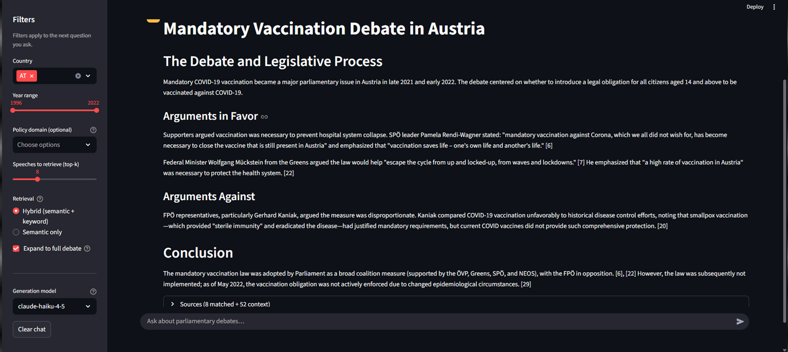

# Ask Parliament

A retrieval-augmented chat app over Austrian parliamentary speeches (ParlaMint v5.0).
Ask a question in natural language — *"What did MPs say about the 2015 refugee crisis?"* —
and get an answer grounded **only** in retrieved speeches, with citations (speaker, party,
date, policy domain) and sidebar filters (country, year range, policy domain, top-k).

Built on the corpus, BGE-m3 embeddings, and CAP policy-domain labels from my
[master's thesis pipeline](https://github.com/pavlesav/master-thesis): the thesis produced
the data; this repo turns it into a production-shaped RAG system built stage by stage — no
RAG frameworks (no LangChain/LlamaIndex), every component written and explainable.

## Status

Working end to end over **99,089 Austrian speeches (1996–2022)**: ingestion → retrieval →
grounded generation → chat UI → evaluation. The corpus is currently Austria; the schema and
filters are built to take Croatia and the UK later.



## Run it

```bash
pip install -r requirements.txt
pip install -e .                 # registers the src/ask_parliament package
# Put ANTHROPIC_API_KEY in .env (gitignored)
python scripts/build_index.py    # build the Chroma index from the thesis pickle
streamlit run app.py             # chat UI (opens http://localhost:8501)
```

> **Note:** `build_index.py` reads the thesis's processed `AT_final.pkl` (the speeches +
> precomputed BGE-m3 vectors), which is gitignored and not part of this repo — it's available
> on request. Without it you can still read all the code and the evaluation methodology, but
> can't build the index locally.

CLIs for poking at the pipeline without the UI:

```bash
python scripts/search.py "renewable energy" --year-from 2015 --k 8   # retrieval only
python scripts/search.py "minimum wage" --hybrid                      # BM25 + vector
python scripts/ask.py "How was mandatory vaccination debated?"        # retrieval + answer
python eval/run_eval.py [--method hybrid]                            # retrieval metrics
```

## How it works

1. **Ingestion** ([scripts/build_index.py](scripts/build_index.py)) — loads the thesis
   pickle, keeps substantive speeches (regular speakers, ≥300 chars), and upserts each
   speech's **precomputed** BGE-m3 vector + text + citation metadata into a persistent
   ChromaDB collection. The vectors are reused from the thesis, never recomputed.
2. **Retrieval** ([src/ask_parliament/retrieval.py](src/ask_parliament/retrieval.py)) —
   embeds the query with the same BGE-m3 model and runs top-k **cosine** search, with
   optional metadata filters (country, year range, CAP domain, party). An optional
   **hybrid** mode ([hybrid.py](src/ask_parliament/hybrid.py)) fuses BM25 keyword search
   with the vector results via Reciprocal Rank Fusion.
3. **Generation** ([src/ask_parliament/generation.py](src/ask_parliament/generation.py)) —
   assembles numbered speeches + the question into a prompt and asks Claude to answer
   **only** from that context, with `[n]` citations, and to say so when the context doesn't
   contain the answer. Returns a structured result (answer + sources + token/latency).
4. **UI** ([app.py](app.py)) — Streamlit chat with the sidebar filters, a retrieval-mode
   toggle (hybrid vs semantic), an expandable *Sources* section per answer, and a
   token/latency caption so cost is visible.

See [DATA_MAP.md](DATA_MAP.md) for the corpus inventory and schemas, and
[CLAUDE.md](CLAUDE.md) for architecture decisions.

## Repository layout

```
ask-parliament/
├── app.py                      # Streamlit chat UI
├── scripts/
│   ├── build_index.py          # ingest the thesis pickle → ChromaDB
│   ├── search.py               # retrieval-only CLI (--hybrid optional)
│   └── ask.py                  # retrieval + grounded answer CLI
├── src/ask_parliament/
│   ├── config.py               # paths, model names, filter constants
│   ├── retrieval.py            # vector search, metadata filters, facets
│   ├── hybrid.py               # BM25 + vector fusion (RRF)
│   └── generation.py           # grounded answer generation (Claude)
├── eval/
│   ├── golden_set.jsonl        # 15 questions + reproducible relevance criteria
│   ├── run_eval.py             # recall@k, MRR, hit@10
│   └── README.md               # evaluation methodology
├── DATA_MAP.md                 # corpus inventory (data provenance)
└── CLAUDE.md                   # architecture decisions & build log
```

## Architecture choices

| Decision | Choice | Why |
|---|---|---|
| Vector store | ChromaDB, persistent local dir | precomputed-embedding ingest + metadata filtering, zero infra |
| Embeddings | BAAI/bge-m3 (1024-d, multilingual) | must match the thesis vectors so they can be reused |
| Distance | cosine | some stored vectors are chunk-averaged and not unit-norm |
| Retrieval unit | speech-level | clean citations; debate segments average 9–18 speeches |
| Hybrid fusion | Reciprocal Rank Fusion (RRF) | combines BM25 + vector by rank, no score normalization |
| Generation | Anthropic Claude (Haiku default, Sonnet switchable) | cheap iteration, quality on demand |
| Evaluation | golden set, recall@k + MRR | explainable, no LLM-as-judge |

## Evaluation

The interesting question for a RAG system is **does retrieval find the right speeches?** —
if it does, generation has what it needs; if it doesn't, no prompt saves it. So the eval
([eval/](eval/)) scores retrieval against a 15-question golden set spanning COVID/health,
defence and foreign affairs, the 2015 migration crisis, banking and budget scandals, energy,
and civil rights.

Each question is tied to one real, identifiable debate. Ground truth — which speeches *should*
come back — is defined **lexically and independently of the embeddings** (a distinctive phrase
within the debate's date window), so it's reproducible and not circular: relevance is decided
by keyword + date, then we test whether the *semantic* retriever surfaces those speeches from a
one-line, often paraphrased question. No human labels, no LLM judge. Full methodology in
[eval/README.md](eval/README.md).

Two conditions, k = 20:

| condition | MRR | recall@10 | hit@10 |
|---|---|---|---|
| unfiltered (whole 27-year corpus) | 0.23 | 0.04 | 0.40 |
| year-scoped (as the sidebar slider is used) | **0.50** | **0.11** | **0.80** |

Reading the numbers: **scoping to the year roughly doubles effectiveness** — for 12 of 15
questions a speech from the *exact* target debate lands in the top 10. Unfiltered, the retriever
still nails distinctive, time-bound debates (compulsory vaccination and Brexit return at rank 1)
but dilutes recurring topics, since with no date cue the embeddings correctly return a topic from
across all 27 years. Two caveats kept honest: recall@k looks low partly by construction (a
relevant set is a whole debate of 7–68 speeches, so when |R| > k even perfect retrieval can't
reach 1.0), and the unfiltered scores are a **conservative floor** because the same topic recurs
on other dates whose speeches are relevant but not in our single-debate judged set.

**Hybrid (BM25 + vector) retrieval** ([src/ask_parliament/hybrid.py](src/ask_parliament/hybrid.py),
`run_eval.py --method hybrid`) fuses keyword and semantic results with Reciprocal Rank Fusion.
Measured against the same set it's **roughly a wash** (year-scoped MRR 0.42 vs 0.50, identical
hit@10, marginally better recall@20): it helps exact-term and recurring queries but demotes the
cases where dense retrieval was already perfect, since RRF rewards consensus. That the eval
*showed* this rather than assuming hybrid always wins is the point. Details in
[eval/README.md](eval/README.md).

## Limitations

- **One country.** Only Austria is indexed; the UK has no speech-level vectors in the thesis
  data and Croatia is deferred. The schema and filters already accommodate both.
- **English machine translation.** Austrian speeches are indexed and answered from their
  English MT; quoting is faithful to meaning, not exact original wording.
- **Noisy policy labels.** CAP domains are episode-level and LLM-assigned (~40% "Other/Mix"),
  so the domain filter is optional and off by default — semantic search already finds on-topic
  speeches without it.
- **Retrieval is dense-first.** Hybrid BM25 + vector retrieval is implemented and selectable,
  but the eval shows it's roughly neutral on this corpus — a tuned fusion weight (favouring the
  dense side) is plausible future work, deliberately not tuned on 15 questions to avoid overfitting.

## License

MIT
