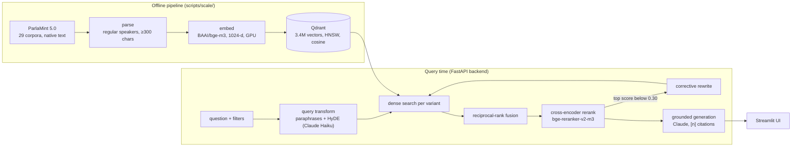
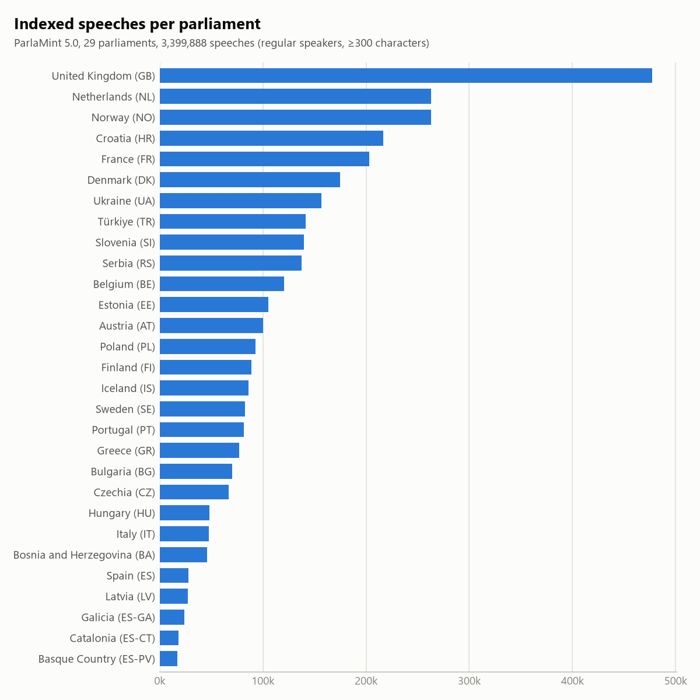
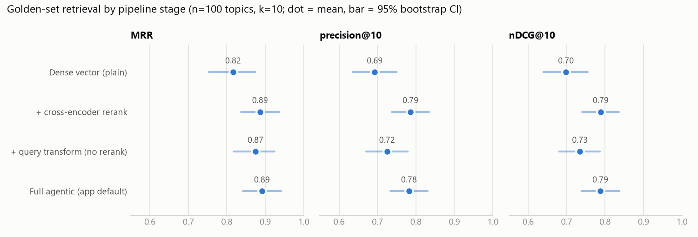

# Ask Parliament

Cross-lingual question answering over 3.4 million European parliamentary speeches, with answers
grounded in and cited to the speeches themselves.

## At a glance

Ask Parliament answers natural-language questions ("How did parliaments respond to rising energy
prices?") from the full [ParlaMint 5.0](https://www.clarin.si/repository/xmlui/handle/11356/2004)
corpus: **3,399,888 speeches from 29 European parliaments, 1996–2024**, retrieved in their original
languages and answered in English with `[n]` citations to speaker, party, country and date.
The stack is BAAI/bge-m3 embeddings in Qdrant, a bge-reranker-v2-m3 cross-encoder, and Claude for
generation, served as a FastAPI backend with a Streamlit frontend via `docker compose`. Every stage
is written directly against the model and database APIs, with no RAG framework.
On a 100-topic, corpus-verified golden set, cross-encoder reranking raises precision@10 from 0.69
to 0.79 and nDCG@10 from 0.70 to 0.79 over dense retrieval; LLM-judged answers score 4.6/5 for
groundedness and 4.8/5 for citation validity, and all 22 out-of-corpus test questions were declined.



<div align="center">

https://github.com/user-attachments/assets/1a9957e1-9642-4afe-bca6-b997f87de9a3

</div>

## How it works

1. **Ingest** ([scripts/scale/](scripts/scale/)). Download each parliament's ParlaMint corpus
   (~6 GB of archives from CLARIN.SI), parse the native plain text plus the English TSV metadata
   into one parquet per parliament, keep regular speakers with at least 300 characters, and embed
   with BAAI/bge-m3 (1024-d, L2-normalised) on the GPU. Each stage is resumable.
2. **Index** ([build_qdrant_index.py](scripts/scale/build_qdrant_index.py)). Load the vectors into
   a Qdrant collection (cosine, HNSW, on-disk vectors, payload indexes on country, year, CAP topic
   and party). HNSW construction is deferred until after the bulk load so upserts stay fast.
3. **Retrieve** ([retrieval.py](src/ask_parliament/retrieval.py),
   [agentic.py](src/ask_parliament/agentic.py)). Plain mode embeds the question and runs a filtered
   top-k cosine search. Agentic mode, the app default, expands the question into paraphrases and a
   hypothetical speech (HyDE), searches each, fuses the lists with reciprocal-rank fusion, reranks
   150 candidates with the cross-encoder, and runs one corrective re-retrieval round if the best
   rerank score falls below 0.30.
4. **Generate** ([generation.py](src/ask_parliament/generation.py)). The numbered speeches and
   the question go to Claude (Haiku by default, Sonnet selectable) with instructions to answer only
   from those speeches, cite each claim, and say so when the speeches do not answer the question.
5. **Serve** ([api.py](src/ask_parliament/api.py), [app.py](app.py)). The FastAPI backend owns the
   models and exposes `/health`, `/meta` and `/ask`; the Streamlit frontend is a thin HTTP client,
   so its container carries no models.

Speeches are stored and retrieved in their original language. For display, cited speeches can be
switched to ParlaMint's own English machine translation
([ParlaMint-en.ana 5.0](https://www.clarin.si/repository/xmlui/handle/11356/2006)), joined into the
index as a payload field and never re-embedded.

<p align="center">
  <picture>
    <source media="(prefers-color-scheme: dark)" srcset="docs/figures/corpus_by_parliament_dark.png">
    
  </picture>
  <br><em>Indexed speeches per parliament after selection. The corpus is uneven: the UK alone is
  14% of it, and the three Spanish regional parliaments are under 25k speeches each.</em>
</p>

## Evaluation

The suite in [eval/](eval/) measures retrieval and generation separately, across all 29
parliaments. Method, caveats and the changes it drove are in [eval/README.md](eval/README.md); the
latest report is [eval/REPORT.md](eval/REPORT.md).

### Retrieval

A golden set of 100 topics (the 2022 invasion of Ukraine, COVID-19 measures, the Greek debt crisis,
energy prices, and so on), each verified against the corpus to have matching speeches. Relevance is
judged by multilingual keyword patterns built from tokens that recur across languages (proper nouns,
shared Latin/Greek stems), so an on-topic speech in any language counts. Four configurations of the
same code isolate each stage.

<p align="center">
  <picture>
    <source media="(prefers-color-scheme: dark)" srcset="docs/figures/retrieval_ablation_dark.png">
    
  </picture>
  <br><em>Mean and 95% bootstrap CI over the 100 golden topics, k=10. Reranking accounts for the
  precision and nDCG gain; the full agentic pipeline matches reranking alone.</em>
</p>

| configuration | MRR | success@10 | precision@10 | nDCG@10 | latency / query |
|---|---|---|---|---|---|
| dense vector (plain) | 0.816 | 0.970 | 0.693 | 0.699 | 1.5 s |
| + cross-encoder rerank | 0.886 | 0.990 | **0.786** | **0.789** | 3.2 s |
| + query transform, no rerank | 0.875 | 0.990 | 0.725 | 0.735 | 2.9 s |
| full agentic (app default) | **0.891** | 0.980 | 0.782 | 0.788 | 4.9 s |

What the ablation shows:

- **Reranking is the stage that matters.** Rescoring 150 candidates with the cross-encoder adds
  about 0.09 to both precision@10 and nDCG@10 over dense retrieval.
- **Query transformation alone improves MRR** (0.82 to 0.87) but barely moves precision.
- **The full agentic pipeline is no better than reranking alone** on this set: all four metrics are
  within 0.01, at 1.7 s more per query. The app defaults to agentic mode; this result suggests
  reranking alone would give the same quality at lower latency.
- **Reranking narrows cross-lingual breadth.** On pan-European topics, relevant top-10 hits come
  from 3.1 parliaments on average with plain retrieval and 2.7–2.8 after reranking.

Latency is the mean per query on one RTX 5070 against on-disk Qdrant, including the Claude Haiku
calls for query variants.

### Generation

Claude Sonnet judges answers generated by Claude Haiku (retrieval: plain, k=8), on a 1–5 scale:

| groundedness | citation validity | answer relevance |
|---|---|---|
| 4.59 [4.41, 4.78] | 4.78 [4.59, 4.94] | 5.00 [5.00, 5.00] |

n=32 golden questions (31 judged for relevance). On 22 out-of-corpus questions (a recipe, arithmetic,
a Wi-Fi password), all 22 were declined and none were answered without support in the retrieved
speeches.

### Limitations

- **The relevance judge is a heuristic, not human labels.** On a deliberately borderline sample
  graded by a stronger LLM ([eval/calibration/](eval/calibration/)), the pattern judge had
  precision 1.00 and recall 0.80: it misses relevant speeches that avoid its keywords, so absolute
  precision and nDCG are underestimates. Read the numbers as a comparison between configurations.
- **Golden items are scoped** to their declared countries and years, which makes the search space
  smaller than an unscoped query.
- **Runs are not bit-identical.** An earlier run of the same set gave plain MRR 0.828 and rerank
  0.872 (0.816 and 0.886 here), within the confidence intervals.
- **LLM-as-judge is a model, not ground truth**, and the generation eval ran with plain retrieval,
  not the agentic default.
- **Dense retrieval only.** No BM25 hybrid: in-memory BM25 over 3.4M speeches does not fit, and
  Qdrant sparse vectors would be the way to add it.
- **Topic filter is noisy.** CAP topic labels are assigned automatically per episode, so the topic
  filter is optional and off by default.
- **English view is machine translation**, shown for reading only; retrieval runs on native text.

## Example

Question: *How did members of parliament respond to Russia's full-scale invasion of Ukraine in 2022?*

Excerpt of the answer from the generation eval run (Haiku, 8 retrieved speeches; the judge scored
it 5/5 on all three criteria):

> Members of parliament across Europe unanimously condemned Russia's invasion as a grave breach of
> international law. Portuguese Deputy Francisco André characterized it as "barbaric and violent"
> aggression that violated Ukrainian sovereignty, territorial integrity, and the UN Charter [1].
> Polish Prime Minister Mateusz Morawiecki called it "barbarism" without justification or
> provocation [3], while Estonian MP Urmas Reinsalu described it as a "war against the freedom of
> the Ukrainian people" [2]. [...]
>
> Parliamentarians demanded strict economic sanctions. Reinsalu called for Russia to be "completely
> isolated from world trade" with "a complete trade embargo" [2]. Spanish and Czech MPs emphasized
> investigating war crimes [...] [5][7].

## Repository structure

```
ask-parliament/
├── app.py                    Streamlit frontend (thin HTTP client over the API)
├── docker-compose.yml        qdrant + api + web
├── Dockerfile.api            backend image (CUDA torch, models)
├── Dockerfile.web            frontend image (streamlit + requests only)
├── pyproject.toml            package and dependencies
├── requirements-web.txt      frontend image dependencies
├── src/ask_parliament/
│   ├── config.py             paths, model names, retrieval knobs
│   ├── models.py             RetrievedSpeech, Facets dataclasses
│   ├── parlamint.py          ParlaMint 5.0 parser
│   ├── retrieval.py          Qdrant vector search + metadata filters
│   ├── query_transform.py    paraphrases, HyDE, corrective rewrite
│   ├── rerank.py             bge-reranker-v2-m3 cross-encoder
│   ├── agentic.py            transform → RRF → rerank → self-correct
│   ├── generation.py         grounded, cited answer generation
│   └── api.py                FastAPI backend: /health, /meta, /ask
├── scripts/
│   ├── search.py             retrieval-only CLI
│   ├── ask.py                retrieval + answer CLI
│   ├── make_figures.py       renders docs/figures/
│   └── scale/                corpus pipeline: download → parse → embed → index,
│                             plus the English view (download_parlamint_en → add_english_text
│                             → patch_english_payload)
├── eval/                     retrieval + generation evaluation, golden and refusal sets,
│                             evallib/, calibration/, offline tests, REPORT.md
└── docs/figures/             README figures (light and dark variants)
```

## Setup and run

Requirements: Python 3.10+, Docker, an NVIDIA GPU for embedding and reranking, and an Anthropic
API key.

```bash
pip install -e ".[dev]"               # package, dependencies, pytest + matplotlib
echo "ANTHROPIC_API_KEY=..." > .env   # gitignored
```

**Build the corpus (one-time, GPU).** The embedding step needs a CUDA build of torch matching your
driver. Details, resumability and parallelism: [scripts/scale/README.md](scripts/scale/README.md).

```bash
pip install torch --index-url https://download.pytorch.org/whl/cu128
python scripts/scale/download_parlamint.py     # all 29 corpora, or --countries LV
python scripts/scale/parse_parlamint.py        # -> data/parlamint/parsed/{CC}.parquet
python scripts/scale/embed_corpus.py           # -> data/parlamint/embeddings/{CC}/*.npy
```

**Index and serve.**

```bash
docker run -d --name qdrant -p 6333:6333 -v "${PWD}/qdrant_storage:/qdrant/storage" qdrant/qdrant
export QDRANT_URL=http://localhost:6333        # PowerShell: $env:QDRANT_URL="http://localhost:6333"
python scripts/scale/build_qdrant_index.py     # resumable

uvicorn ask_parliament.api:app --host 0.0.0.0 --port 8000   # backend
streamlit run app.py                                        # UI at http://localhost:8501
```

Or run the whole stack with `docker compose up --build` (UI at http://localhost:8501). This needs a
populated `./qdrant_storage`, `./data/parlamint/facets.json` and `.env`; the `api` service requests
a GPU through the NVIDIA Container Toolkit (remove its `deploy` block to run on CPU).

**Command line.**

```bash
python scripts/search.py "renewable energy" --country GR --year-from 2015
python scripts/ask.py "What did MPs say about energy prices?" --agentic
```

**Evaluation.**

```bash
python -m pytest eval/tests -q             # offline unit tests, no Qdrant or API key needed
python eval/retrieval_eval.py --k 10       # golden set, all four configurations
python eval/generation_eval.py             # LLM-as-judge answer quality + refusal
python eval/run_all.py                     # build golden set -> retrieval -> generation -> report
python scripts/make_figures.py             # re-render docs/figures/ from the latest results
```

## Data and citation

ParlaMint 5.0 and ParlaMint-en.ana 5.0 are distributed by CLARIN.SI under CC BY 4.0. If you use
this project with the corpus, cite:

> Erjavec, T., Kopp, M., Kuzman Pungeršek, T., Ljubešić, N., Ogrodniczuk, M., Osenova, P., et al.
> (2025). *Multilingual comparable corpora of parliamentary debates ParlaMint 5.0.* Slovenian
> language resource repository CLARIN.SI. http://hdl.handle.net/11356/2004

> Kuzman Pungeršek, T., Ljubešić, N., Erjavec, T., Kopp, M., Ogrodniczuk, M., Osenova, P., et al.
> (2025). *Linguistically annotated multilingual comparable corpora of parliamentary debates in
> English ParlaMint-en.ana 5.0.* Slovenian language resource repository CLARIN.SI.
> http://hdl.handle.net/11356/2006

## License

Code: MIT (see [LICENSE](LICENSE)). Data: ParlaMint is CC BY 4.0 and is not included in this
repository.
